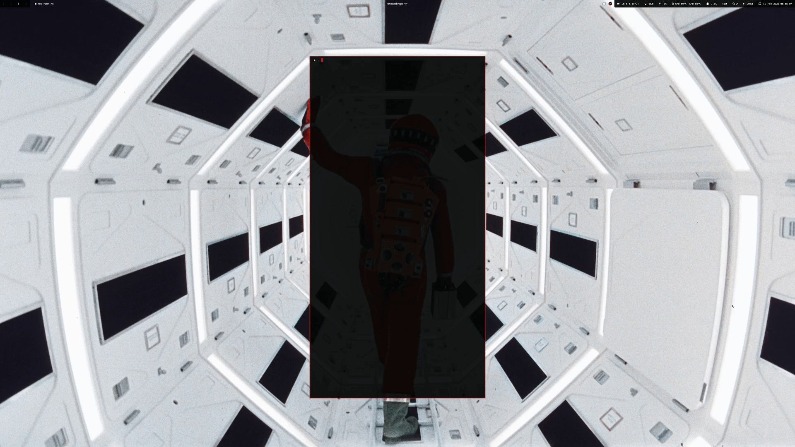
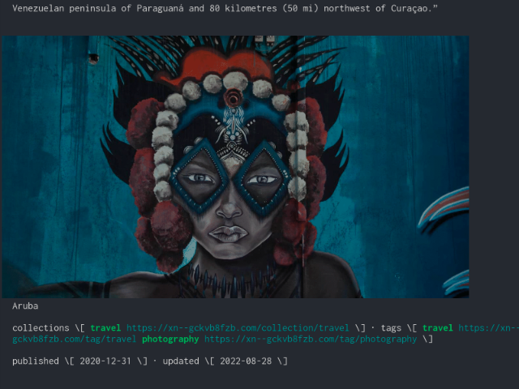

reader
------

[](https://matrix.to/#/%21PHlbgZTdrhjkCJrfVY%3Amatrix.org)

*reader* is for your command line what the “readability” view is for modern
browsers: A lightweight tool offering better readability of web pages on the
CLI.



`reader` parses a web page for its actual content and displays it in nicely
highlighted text on the command line. In addition, `reader` renders embedded
images from that page as colored block-renders on the terminal as well.


## Installation 

```
go install github.com/mrusme/reader@latest
```

If the above fails, then the following should work:

```
git clone https://github.com/mrusme/reader.git
cd reader
go install 
```


## Usage

```sh
reader https://xn--gckvb8fzb.com/superhighway84/
```

Don't render images:

```sh
reader --image-mode none https://xn--gckvb8fzb.com/superhighway84/
```

Output raw markdown, don't pretty print:

```sh
reader -o https://xn--gckvb8fzb.com/superhighway84/
```

Read from file:

```sh
reader ${HOME}/downloads/example.com.html
```

Read from stdin:

```sh
curl -o - https://superhighway84.com | reader -
```

Render images using the SIXEL graphics encoder:

```sh
reader --image-mode sixel https://xn--gckvb8fzb.com/travel-aruba/
```



More options:

```sh
reader -h
```


## Examples


### Using `reader` from within `w3m`

While on a web page in w3m, press `!` and enter the following:

```
reader $W3M_URL
```

This will open the current url with `reader`. `w3m` will wait for you to press
any key in order to resume browsing.

If you want to navigate through the page:

```
reader $W3M_URL | less -R
```


### Using `reader` from within `vim`/`neovim`

Add the following function/mapping to your `init.vim`:

```
function s:vertopen_url()
  normal! "uyiW
  let mycommand = "reader " . @u
  execute "vertical terminal " . mycommand
endfunction
noremap <Plug>vertopen_url : call <SID>vertopen_url()<CR>
nmap gx <Plug>vertopen_url
```

Open a document and place the cursor on a link, then press `g` followed by `x`.
Vim will open a new terminal and show you the output of `reader`.


